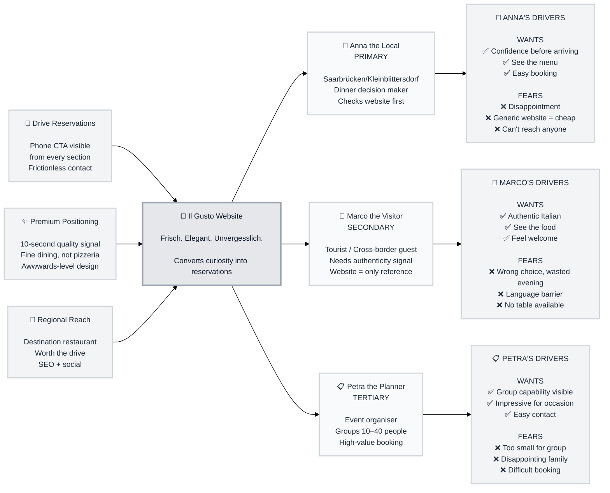

# Trigger Map: Il Gusto Website Redesign

> Visual overview connecting business goals to user psychology

**Created:** 2026-06-01
**Author:** EVis
**Methodology:** WDS Trigger Mapping

---

## Strategic Documents

- **02-Anna-the-Local.md** — Primary persona
- **03-Marco-the-Visitor.md** — Secondary persona
- **04-Petra-the-Planner.md** — Tertiary persona

---

## Positioning — LOCKED

**Target:** #1 Italian restaurant in the Saarbrücken area
**Stage:** 2 years old, building awareness, quality already proven
**Weapon:** 4.9★ (130+ reviews) — must be surfaced immediately on the site
**The gap:** Quality exists. The website doesn't show it. Fix the website.

---

## Vision

**Il Gusto's website becomes as unforgettable as the meal itself** — a digital experience that earns the trust of first-time visitors and reaffirms the choice of returning guests, driving table reservations for the #1-rated Italian restaurant in Kleinblittersdorf.

---

## Business Objectives

### Objective 1: Drive Table Reservations

- **Metric:** Phone reservation enquiries via website
- **Target:** Increase reservation-driven contacts measurably within 3 months of launch
- **Timeline:** From site launch

### Objective 2: Establish Premium Positioning

- **Metric:** Bounce rate reduction + time on site
- **Target:** Visitors who land understand within 10 seconds that this is fine dining, not a generic pizza place
- **Timeline:** From site launch

### Objective 3: Attract New Guests from Wider Region

- **Metric:** Visitors from Saarbrücken, French border area (Forbach, Sarreguemines)
- **Target:** Position as a destination restaurant worth the drive
- **Timeline:** Ongoing via SEO + social referrals

---

## Target Groups (Prioritized)

### 1. Anna the Local (PRIMARY)

**Priority Reasoning:** The largest volume of guests. Local couples, families, and friends in the Kleinblittersdorf/Saarbrücken area making a dinner decision for tonight or this weekend.

> Anna wants to be confident she's choosing somewhere genuinely special — not just decent. She's heard about Il Gusto from a friend, checks the website, and needs to feel the quality immediately.

**Key Positive Drivers:**
- Wants to feel good about her choice before arriving
- Wants to see the actual menu and know what to expect
- Wants to know it's worth a reservation (not walk-in only)

**Key Negative Drivers:**
- Fears disappointment — a mediocre meal after raising expectations
- Fears the website not matching reality (generic template = cheap restaurant?)
- Fears not being able to reach someone / no easy way to book

---

### 2. Marco the Visitor (SECONDARY)

**Priority Reasoning:** Tourists, cross-border French guests, and Saarbrücken visitors looking for an authentic Italian dinner outside the city centre.

> Marco is visiting the Saar region, staying nearby, and searching for "authentic Italian restaurant Saarland." He doesn't know the area. The website is his only reference point.

**Key Positive Drivers:**
- Wants authentic Italian — not a franchise, not pizza delivery
- Wants to see the food before deciding (gallery, dish photos)
- Wants to feel welcome as a non-regular

**Key Negative Drivers:**
- Fears choosing wrong and wasting a special evening
- Fears a language barrier or unfriendly atmosphere
- Fears arriving to a full house with no reservation

---

### 3. Petra the Planner (TERTIARY)

**Priority Reasoning:** Lower volume but high value. People organising birthdays, anniversaries, corporate dinners for 10–40 guests. Often decide based on the website alone.

> Petra is planning her parents' 40th anniversary dinner for 25 people. She needs to know the restaurant can handle it, feels right for the occasion, and is easy to contact.

**Key Positive Drivers:**
- Wants to see that the restaurant handles private events / groups
- Wants a venue that will impress her guests
- Wants clear contact info and a responsive host

**Key Negative Drivers:**
- Fears the restaurant being too small or not set up for groups
- Fears looking foolish if the choice disappoints family
- Fears a difficult booking process

---

## Trigger Map Visualization

---

## Design Focus Statement

**Design for Anna first.** She is the highest-volume visitor and her decision pattern is the critical path: lands on the site → feels quality immediately → sees the menu → calls to reserve. Every design decision must serve this path.

**Primary Design Target:** Anna the Local

**Must Address:**
- Instant quality signal — fine dining visible within 3 seconds of landing
- Menu accessible and easy to read
- Phone number prominent and persistent
- Hausgemachte Pasta as emotional anchor (Anna's friends mentioned it)

**Should Address:**
- Gallery that shows the actual restaurant atmosphere (not stock photos)
- Opening hours clear and visible
- Group/event capability mentioned for Petra

---

## Cross-Group Patterns

### Shared Drivers
All three personas share one fear: **choosing wrong and regretting it.** The website must immediately eliminate doubt. Quality signals (4.9★ rating, review quotes, food photography) address all three.

### Unique Drivers
- Anna needs menu clarity + easy phone access
- Marco needs authenticity signals + warm welcome tone
- Petra needs group capability mentioned + direct contact path

### Potential Tensions
None significant. A fine dining aesthetic serves all three. The risk is over-indexing on exclusivity (deterring Anna) — warmth must balance elegance.

---

## Next Steps

- [x] **Product Brief** — complete
- [x] **Trigger Map** — complete
- [ ] **Phase 3: UX Scenarios** — next
- [ ] **Phase 4: Specifications**
- [ ] **Phase 5: Build**

---

_Generated by WDS — EVis + Freya, research-based_
